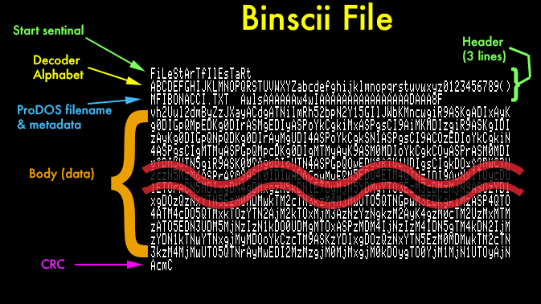

# Unbinscii

This is a program to convert binscii files from old usenet posts back into files.

It is also an attempt to quickly dive into some Ruby learnin'.

## Installation

This is a Ruby script and should run on most any system that has Ruby installed.

## Usage
Usage: `ruby unbinscii.rb  <infiles>`

Works on single files or multiple file inputs.  
`ruby unbinscii.rb demofiles/HELLO.TXT.01`

`ruby unbinscii.rb demofiles/FIBONACCI*`

## Notes
So what is `binscii`?  

### Ye olde usenet
It's an old text format we used to use back in the dial up and early academic broadband days to share binary files on message boards & usenet newsgroups, like comp.binaries.apple2.  It is similar to UUencoding and base64 in that it uses 6-bits (allowing up so 64 different characters) to represent the data.  The means that it takes 4 character bytes of binscii to represent 3 binary bytes from the original file, or a 33% increase in file size.  

This is a trade-off we often make for sending data over a different channel.  This still happens with modern emails where it's common to send binary data using MIME with base64 encoding.

### Differences
There are two main differences between binscii and other 6-bit text encoding schemes.

1. It has a defineable alphabet in each segment header.  Though I'm unaware of anyone using this feature, it could work as some sort of "poor man's security", by sending the segments with different alphabets, and using pre-shared alphabets with the sender & recipient as a secret key.  Though this would be mere obfuscation and not really a secure method.  I'm really not sure what this feature was intended for.

2. It includes metadata for ProDOS, like the filetype and auxtype, so that decoders could helpfully set the files to the correct type to be seen by the OS after decoding.

### File Format
I've included two small example files that you can look at to see what the format looks like, or you can search the web for other sources.

Binscii files contain 12K segments (12,288 bytes exactly), except the last segment which may be short.

There are 3 parts to a binscii file:
1. Header
2. Body
3. CRC

#### Header
The header is 3 lines starting with a "sentinal" text to tell us where the file starts:
> FiLeStArTfIlEsTaRt

> ABCDEFGHIJKLMNOPQRSTUVWXYZabcdefghijklmnopqrstuvwxyz0123456789()

> MFIBONACCI.TXT  AwlsAAAAAAw4wIAAAAAAAAAAAAAAAADAAA8F

Line 1 has our sentinal, "FiLeStArTfIlEsTaRt"

Line 2 is our alphabet for decoding

Line 3 is ProDOS filename (with length char at start followed by 15 chars), followed by the file metadata

I won't describe the metadata here as it's listed in the doc in the credits below.

#### Body
The body is multiple lines of encoded data that are quartets of characters representing triplets of binary data.  

Imagine the bits of three input bytes are as follows:
> abcdefgh ijklmnop qrstuvwx

Then we get the four output bytes:
> 00stuvwx 00mnopqr 00ghijkl 00abcdef

Then each of those bytes, which now have values from 0 - 63, is translated into the character in our alphabet at that index.

To decode, we simply reverse the process... look up the four 6-bit bytes using the alphabet, and recombine them with some bit shifting.

If the data in the body doesn't have exactly 64 characters (representing 48 bytes), then it is padded with binary zeroes to fill out the line exactly.

#### CRC
The last line after reaching the end of a segment body is the CRC.  It is always four characters, representing 3 bytes, a 2-byte CRC value with a zero attached at the end.

### Woops
This isn't a full implementation.  
- Doesn't create binscii files (yet). 
- Can't do out-of-order decoding which is possible via the segment start information.
- Doesn't support multiple file outputs.
- Doesn't do anything with ProDOS metadata (integration with disk image tool would be nice, eh?)
- Doesn't check CRC

It also is not meant to be good code.  This was partly an experiment to see if I could write a simple CLI app in Ruby without actually reading about the language, but only using Google/StackOverflow.  I found some interesting things in Ruby and some annoying things, but clearly it is a capable language in the right hands (not mine.)

## Credits
Based on info here:

https://mirrors.apple2.org.za/apple2.caltech.edu/binscii.txt

https://mirrors.apple2.org.za/ground.icaen.uiowa.edu/Mirrors/uni-kl/doc/binscii.format

## License
This project is made available under the MIT License

Copyright (c) 2017 Dagen Brock

For more information see license.txt
